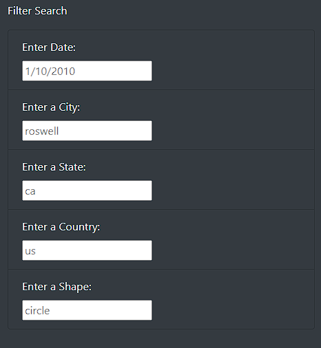
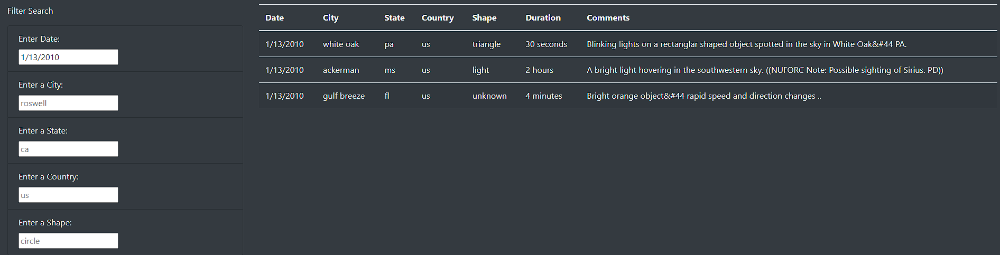

# UFOs
## Overview
The purpose of this project is to create a dynamic webpage for UFO sitings using javascript, html, and css. This webpage will have a title, synopsis, table of UFO data, and filters for that table. The dynamic element is the filters. The user will be able to filter for key values of the UFO data. These include date of occurance, city, state, country, and shape. The table also includes duration of occurance and any notes. Lastly, there will be discussion of drawbacks of the webpage and recommendations for future development.

## Resources
Software: Javascript, html, css, Bootstrap 4.0.0, VS Code 1.70.2  
Data: [Data.js](static/js/data.js)

## Results
### Filter Summary
When running the [webpage](index.html) in your browser you can view the UFO Finder. The top section has the title and blurb about relevancy of the UFO sitings. In order to filter the data in the below table, see the filter search box that looks like this:

The filter table has placeholders in each text box that give valid examples of filter searches. A valid date would look like `1/10/2010`. You can refernce the table values to see other valid filter searches.

### Filter Examples
In order to filter the table, values must be typed as text into the input boxes under filter search. If I use the date box under "Enter Date", I can filter the UFO sitings based on date. For example if I were to type `1/13/2010` into the filter search it would yield:

You can use any combination of filters so long as the input in the text box has a matching value in the UFO table. An example of using multiple filters is if I wanted to know all the UFO sitings from California on January 10th, 2010. I would type `1/10/2010` in the date box and `ca` in the state box. The table only uses state abbreviations.

Keep in mind that you cannot filter on the duration and comments, but those fields can still be viewed in the table after filtering using any of the valid filters.

## Summary
### Drawbacks
A major drawback of the design is the input in the filter search. The inputs have to be very specific and not always intuitive. For example, the date field is of the type M/DD/YYYY for 1/10/2010, but of type M/D/YYYY when the date is 1/9/2010. Accepting results of type MM//DD//YYYY or MM/DD/YY would help the user inputs. The same can be said about capitalization in the other fields. `ca` will yield results for California, but `CA` will not. Including ease of filter inputs for the user would make navigating the webpage better.

### Future Recommendations
In order to develop the webpage further I would make a couple of recommendations:

1. I would not have the entire table load in. It is very lengthly and bloats the entire webpage. If I want to have any information below the table I would have to scroll all the way past the large table. This would be even more true if we brought in UFO data that was for more than the first two weeks of January in 2010.

2. I would also accentuate the filter search. Right now the filter search is not centered and it hard to tell the distinction between the filter search and the table. Creating a more robust filter search would draw the user to it quicker. Since it is the only aspect of the webpage that the user can interact with, it is very important the user notices where it is.

